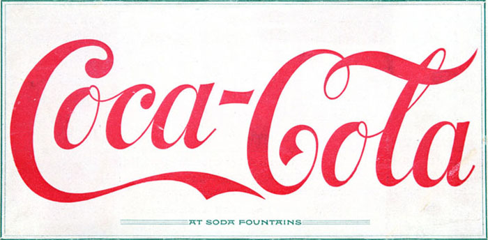
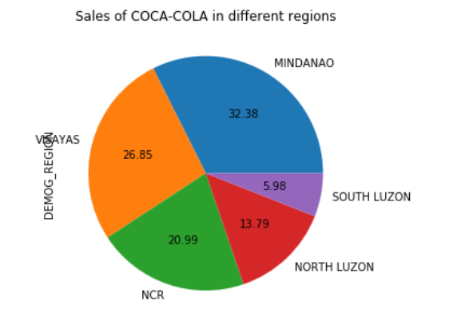
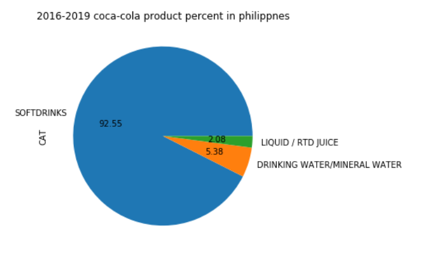

# EDA

### project title

Customer Behavior - Coca-Cola

###  Market analysis in the Marketing strategy of Coca Cola

> Non-alcoholic beverages market is ever-growing industry & with the advent of growing Asian markets & developing nations the consumption will be higher also due to the changing lifestyle, [economic](https://www.marketing91.com/economic-systems/) conditions & changing buying habits. In this industry customer have got lots of options ranging from water to tea/coffee to soft drinks, so chances of [customer switching](https://www.marketing91.com/brand-switching/) to another brand is high. The only way to [differentiate products](https://www.marketing91.com/product-differentiation-2/) & retain customers is the strong brand building, and creating pull in the market.
>
> **Customer analysis in the Marketing strategy of Coca Cola –** Coca cola targets a [mass market](https://www.marketing91.com/mass-market/). And the customer expectation is low price, great taste, convenience & accessibility and various options to choose from.

### dataset

PHILIPPINES_BEVERAGE_PURCHASE_HHP_CLEANED.csv

### columns

| column name          | description                                                  |
| -------------------- | ------------------------------------------------------------ |
| SEQNO                | Unique Key                                                   |
| HOUSE                | Unique Household Identifier                                  |
| 1W Rolling Week End  | Date of purchase - rolling Week End(1 week).                 |
| 4W Rolling Week End  | Date of purchase - rolling Week End(4 week).                 |
| WEEK DAY             | Day of Week,1 to 7,1 = Sunday                                |
| TRADE                | Modern Trade or General Trade(Traditional)                   |
| CHANNEL              | Specific Trade Channel                                       |
| STORE                | Specific Store                                               |
| Packs_Bought_CORR    | #of Product Packages bought: 2 packs of water,each packed bottles 500ml each = 2 packs bought |
| Units_Per_Pack_CORR  | #of Product Units bought: 2 packs of water, each pack is 10 bottles 500ml each = 10 units per pack |
| Units_Bought_CORR    | Total units purchased: 2 packs of water,each pack is 10 bottles 500ml each = 10 units per pack |
| Liters_Bought_CORR   | Total liters purchased: 2 packs of water,each pack is 10 bottles 500ml each = 2*10 * 0.5 = 10 liters total |
| Spend_CORR           | Total money paid for purchase                                |
| Price_Per_Liter_CORR | Spend_CORR / Liters_Bought_CORR                              |
| Unit_Size_CORR       | Size of the unit purchased: 2 packs of water,each pack is 10 bottles 500ml each = 500 ml unit size |
| REFID                | Some identifier, we did not understand which,drop            |
| CAT                  | Product Category                                             |
| MANUFACTURER         | Product Manufacturer                                         |
| BRAND                | Product Brand                                                |
| PACKSIZE(ml)         | Not too reliable unit size, we have recalculated it,see above |
| PACKAGE TYPE         | Product Package(Class bottle,PET bottle,etc.)                |
| VARIANT1             | Other product attributes                                     |
| FLAVOUR              | Other product attributes                                     |
| VARIANT2             | Other product attributes                                     |
| VARIANT3             | Other product attributes                                     |
| SKU_DESC             | Product Description                                          |
| CW_1Y                | Household present in Panel Past 1Y                           |
| CW_2Y                | Household present in Panel Past 2Y                           |
| DEMOG_REGION         | Household region of living                                   |
| DEMOG_HHSIZE         | Household size                                               |
| DEMOG_HHSEC          | Household socio-economic status                              |
| DEMOG_HWAGE          | Age of HH head                                               |
| DEMOG_KIDS           | #of kids                                                     |
| DEMOG_WORKINGSTATUS  | Working  or not                                              |
| DEMOG_STRATA         | Urban or Rural                                               |
| DEMOG_LIFESTAGE      | Family composition                                           |

### outputs

1. Model comes first – produces the output of a form of a  matrix: 
   1. We need to understand the probability of switching the product
   2. Division by product and by channel – if I increase the price – will they go to a different store to buy the same product OR will they buy something else in the same store
   3. How likely are households to buy – 3dl, cans, plastics – they don’t switch..?
2. Decision tree – consumers 
   1. cola or not cola (fanta)
   2. Specific brands (coca cola, mountain dew)
   3. The package size

### graphic analysis

* Coca-cola market share in philippines from 2016 to 2019

  

  

* sales of coca-cola in different regions

* the coca-cola product percent in Philippines between 2016-2019

* Sales of coca-cola in different channel

* Price of package —— 'can' for different brands

  

* Price of package ——'plastic bottle' for different brands

  

* Sales of different packsize under the manufactuere of coca-cola

  

* Sales of different packages under the manufactuere of coca-cola

  

> Analysis the columns of DEMOG_***

* Sales of DEMOG_STRATA in different regions

  

  

* Analysis which region has the most coca-cola buying based on households size

  * which households buys the most coca-cola?

    

    * from above graphic,we can see that household size with 3-4 and 5-6 buy the most for coca-cola,and according this, we can analysis which region has this type of household?

  * which region has the most number for this type of household?

    

* Analysis which regions have the most coca-cola buying based on "DEMOG_HHSEC"?

  * which DEMOG_HHSEC buys the coca-cola most?

    

    * From above graphic,we can see that HHSEC with D buy the most for coca-cola,and according this, we can analysis which region has this type of DEMOG_HHSEC?

  * which region has the most number of DEMOG_HHSEC:D ?

    

* Analysis which regions have the most coca-cola buying based on "DEMOG_HWAGE"?

  * which DEMOG_HWAGE buys the coca-cola most?

    

    * The graphic shows that DEMOG_HWAGE with Age above 35 buys coca cola most,so which region has most population of this age group?

  * Which region has most population of this age group?

    

* Analysis which regions have the most coca-cola buying based on "DEMOG_WORKINGSTATUS"?

   * which DEMOG_WORKINGSTATUS buys the coca-cola most?

     

     * It shows that people not working buy the coca cola more, and based on this , we can analysis that which region has this group of people more.

   * Which region has the more population that not working?

     

* Analysis which regions have the most coca-cola buying based on "DEMOG_LIFESTAGE"?

  * which DEMOG_LIFESTAGE buys the coca-cola most?

    

    * We can see from the chart that young HH buys the coca cola most,so we can get which region has the most population of young HH?

  * Which region has the more young HH population ?

    

> AS the analysis above, we can know that NCR has the highest sales for the coca cola.

* The sales change of different regions from 2016 to 2019

  

